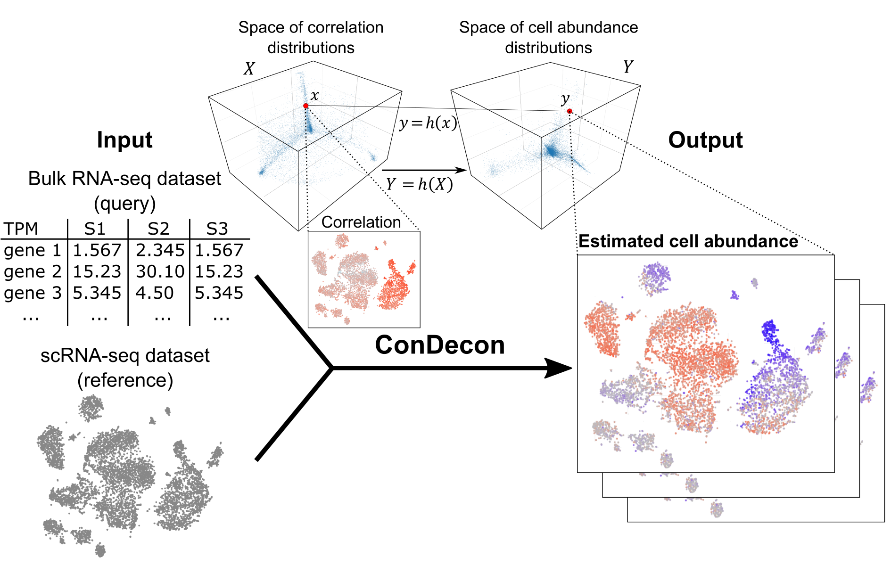

## 

<!-- badges: start -->

 

<!-- badges: end -->

# ConDecon

`ConDecon` is a clustering-independent deconvolution method for estimating cell abundances in bulk tissues using single-cell RNA-seq data. The aim of ConDecon is to infer a probability distribution across a reference single-cell RNA-seq data that represents the likelihood for each cell in the reference data to be present in the query bulk tissue. To that end, ConDecon requires three inputs:

-   Single-cell gene expression count data
-   Single-cell latent space
-   Normalized bulk data

With this information, ConDecon learns a relationship that explains the similarity between the gene expression profile of bulk and single-cell data as a function of changes in cell abundances, without relying on cluster labels or cell-type specific gene expression signatures at any step. ConDecon enables previously elusive analyses of dynamic cellular processes in bulk tissues and represents an increase in functionality and phenotypic resolution with respect to current methods for gene expression deconvolution. Additionally, ConDecon can be applied to other omics data modalities including spatial transcriptomics and chromatin accessibility data. Overall, we anticipate that these features will improve our understanding of tissue cell composition by facilitating the inference of cell state abundances within complex bulk tissues, particularly in the context of evolving systems like development and disease progression.

Aubin, R. G., Montelongo, J., Hu, R., Camara, P. G. *Clustering-independent estimation of cell abundances in bulk tissue using single-cell RNA-seq. data*. **In preperation** (2023).

# Installation

    devtools::install_github("CamaraLab/ConDecon")
    library(ConDecon)

# Tutorials

Tutorial for running ConDecon on simulated bulk and single-cell RNA-seq data: [Quick set up and example](/examples/Quick_set_up_and_example.md)
