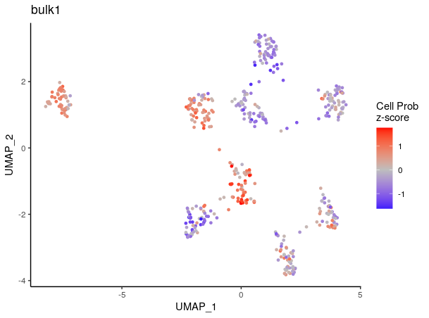
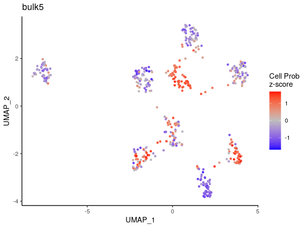

ConDecon
================

```ConDecon``` is a clustering-independent deconvolution method for estimating cell abundances in bulk tissues using single-cell RNA-seq data. More information can be found in:

Aubin, R. G., Montelongo, J., Camara, P. G. _Clustering-independent estimation of cell abundances in bulk tissue using single-cell RNA-seq. data_. **BioRxiv** (2022).

Installation
-----------------

```
devtools::install_github("CamaraLab/ConDecon")
library(ConDecon)
```

Tutorial
-----------------

For this example, we simulated single-cell RNA-seq data containing 9 clusters/groups (gps) using the software [*Splatter*](https://doi.org/10.1186/s13059-017-1305-0). Let's load the single-cell data:

```
## Single-cell gene expression count data
data(counts_gps)
?counts_gps
## Single-cell PCA latent space
data(latent_gps)
## Top 2,000 variable genes
data(variable_genes_gps)
## UMAP embedding of the single-cell data
data(umap_embedding_gps)
## cluster IDs for the single-cell data
data(cell_gps)
```


Plot the reference single-cell data:

```
library(ggplot2)
ggplot(data.frame(umap_embedding_gps), aes(x = UMAP_1, y = UMAP_2, color = cell_gps)) + 
  geom_point(size = 0.5) + theme_classic()
```


We also generated 5 unique bulk gene expression profiles by aggregating the clusters together at varying proportions.
Let's load the bulk data:

```
data(bulk_gps)
```

ConDecon requires 4 input files:
1. Single-cell count matrix
2. Latent space of the single-cell data
3. Variable features associated with the single-cell data
4. Bulk data
Let's run ConDecon:

```
ConDecon_obj = RunConDecon(counts = counts_gps, latent = latent_gps, 
  variable.features = variable_genes_gps, bulk = bulk_gps)
```

Plot the predicted cell abundances for each of the 5 bulk samples:

```{r}
PlotConDecon(ConDecon = ConDecon_obj, umap = umap_embedding_gps)
```







