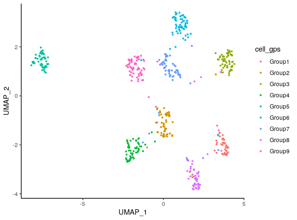
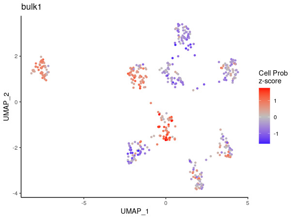
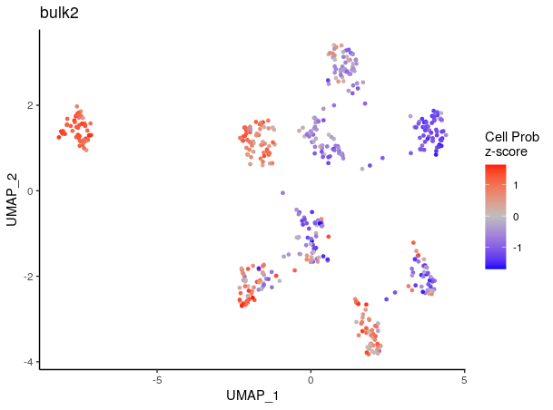
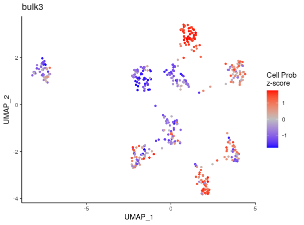
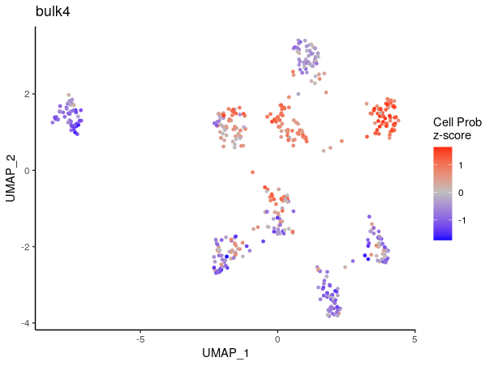
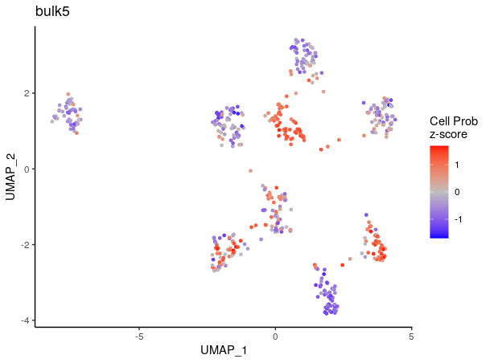

# Quick set up and example

## Load example single-cell data

For this example, we simulated single-cell RNA-seq data containing 9 clusters/groups (gps) using the software [*Splatter*](https://doi.org/10.1186/s13059-017-1305-0).

    ## Single-cell gene expression count data
    data(counts_gps)

    ## Single-cell PCA latent space
    data(latent_gps)

    ## Top 2,000 variable genes
    data(variable_genes_gps)

    ## UMAP embedding of the single-cell data
    data(umap_embedding_gps)

    ## cluster IDs for the single-cell data
    data(cell_gps)

Plot the reference single-cell data colored by cluster IDs:

    library(ggplot2)
    ggplot(data.frame(umap_embedding_gps), aes(x = UMAP_1, y = UMAP_2, color = cell_gps)) + 
      geom_point(size = 0.5) + theme_classic()

{width="75%"}

## Load example bulk data

For this example, 5 unique bulk gene expression profiles were generated by aggregating cell from each cluster at various proportions.

    data(bulk_gps)

## Run ConDecon

'RunConDecon' is the main function necessary to infer cell abundances for each input bulk sample. This function requires 4 inputs:

1.  Single-cell count matrix
2.  Single-cell latent space matrix
3.  Character vector of variable features associated with the single-cell data
4.  Normalized bulk data matrix

The output of this function is a ConDecon object containing a norm_cell.probs matrix with the predicted cell probability distributions.

    ConDecon_obj = RunConDecon(counts = counts_gps, latent = latent_gps, variable.features = variable_genes_gps, bulk = bulk_gps)

Plot the predicted cell abundances for each of the 5 bulk samples:

    PlotConDecon(ConDecon = ConDecon_obj, umap = umap_embedding_gps)

{width="49%"} {width="49%"} {width="49%"} {width="49%"} {width="49%"}
