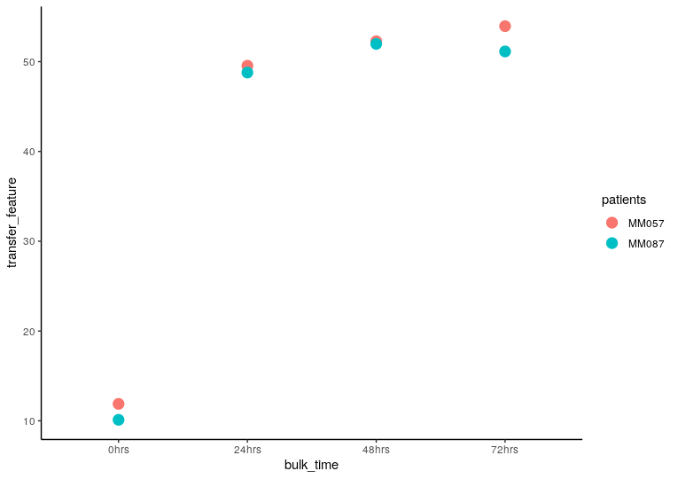

```{r, include = FALSE}
knitr::opts_chunk$set(
  collapse = TRUE,
  comment = "#>"
)
```

ConDecon's general approach for estimating cell abundances can be applied to other omics data modalities such as chromatin accessibility data. In this tutorial, we will apply ConDecon to bulk and single-cell ATAC-seq data from patient-derived melanoma cell cultures where the SOX10 transcription factor was knocked down by siRNA. Cells were then sampled for sequencing at 0, 24, 48, and 72 hours after SOX10 knockdown ([Bravo González-Blas et al, Nature Methods, 2018](https://doi.org/10.1038/s41592-019-0367-1)). For convenience, the processed data associated with this tutorial is available on Zenodo.
Note: To apply ConDecon to chromatin accessibility data, the bulk and single-cell ATAC-seq data must contain a common set of peaks. We created this by binning the genome into non-overlapping 10KB bins.

```{r, eval=FALSE}
library(ConDecon)
library(ggplot2)
library(gridExtra)
```

We will use single-cell ATAC-seq data from each of the four sampling times as a reference dataset. 

```{r, eval=FALSE}
snATAC_count <- readRDS("../snATAC_count.Rds")
snATAC_SVD <- readRDS("../snATAC_SVD.Rds")
snATAC_var_genes <- readRDS("../snATAC_var_genes.Rds")
snATAC_meta_data <- readRDS("../snATAC_meta_data.Rds")
```


```{r, eval=FALSE}
# Visualize the sampling time of the single-cell ATAC-seq data
ggplot(snATAC_meta_data, aes(x = UMAP_1, y = UMAP_2, color = hrs)) + 
  geom_point(size = 3) + 
  theme_classic()
```
```{r, echo=FALSE, out.width="800px"}
knitr::include_graphics("ATAC_single_cell_hrs.png")
```
We are interested in using ConDecon to deconvolve 8 bulk ATAC-seq samples from 2 different patients (MM087 and MM057) and each of the four sampling times.

```{r, eval=FALSE}
BulkATAC_data <- readRDS("../BulkATAC_data.Rds")
BulkATAC_meta_data <- readRDS("../BulkATAC_meta_data.Rds")
```

We can now use 'RunConDecon' to deconvolve bulk ATAC-seq data using single-cell ATAC-seq data as reference.

```{r, eval=FALSE}
startTime <- Sys.time()

ConDecon_obj = RunConDecon(counts = snATAC_count, 
                           latent = snATAC_SVD[,2:20], 
                           bulk = BulkATAC_data, 
                           variable.features = snATAC_var_genes)

endTime <- Sys.time()
print(endTime - startTime)
#Time difference of 1.620496 mins
```

With 'PlotConDecon', we can visualize the relative cell probabilities of each bulk sample. We find that ConDecon infers a higher abundance of reference cells from the same sampling time as the query bulk sample, independently of the specific patient cell line of the query sample.

```{r, eval=FALSE}
# Let's visualize the cell abundance distribution of all 8 bulk samples
PlotConDecon(ConDecon_obj = ConDecon_obj, 
             umap = snATAC_meta_data[, c("UMAP_1", "UMAP_2")], 
             pt.size = 3)
```
```{r, echo=FALSE, out.width="800px"}
knitr::include_graphics("ATAC_PlotConDecon.png")
```
We can now use the cell probabilities inferred by ConDecon to deconvolve the sampling time of the bulk ATAC-seq data. Using 'TransferFeatures', we will estimate the sampling time of each bulk sample and compare these to the actual sampling time.

```{r, eval=FALSE}
ConDecon_obj = TransferFeatures(ConDecon_obj = ConDecon_obj, 
                                feature = snATAC_meta_data$time_hrs)
```


```{r, eval=FALSE}
meta_data <- data.frame(bulk_time = BulkATAC_meta_data$hrs, 
                        transfer_feature = ConDecon_obj$TransferFeatures[1,], 
                        patients = BulkATAC_meta_data$patient)

ggplot(meta_data, aes(x = bulk_time, y = transfer_feature, color = patients)) + 
  geom_point(size = 3) + 
  theme_classic()
```
```{r, echo=FALSE, out.width="800px"}

```


