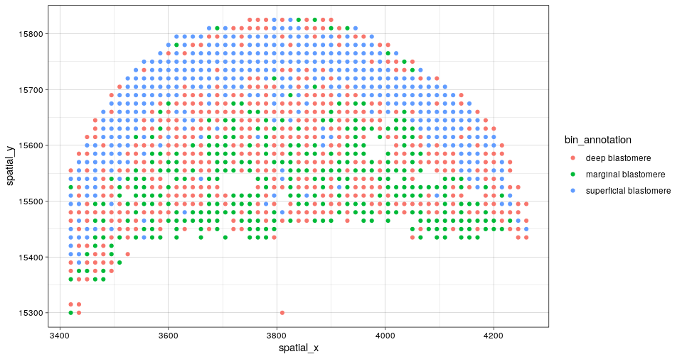
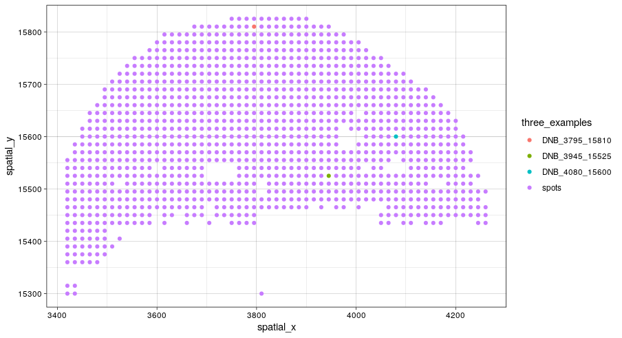
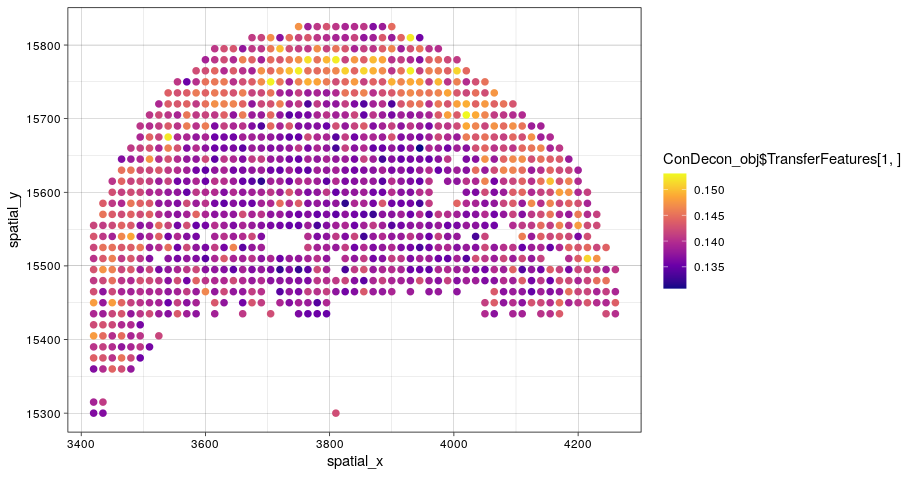
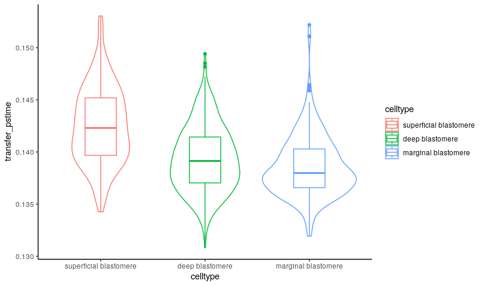

```{r, include = FALSE}
knitr::opts_chunk$set(
  collapse = TRUE,
  comment = "#>"
)
```


ConDecon's general approach for estimating cell abundances can be applied to other omics data modalities such as spatial transcriptomics. In this tutorial, we will apply ConDecon to stereo-seq and single-cell RNA-seq data of 10 zebrafish embryos profiled 3.3 hours post-fertilization ([Lui et al, Developmental Cell, 2022](https://doi.org/10.1016/j.devcel.2022.04.009)). For convenience, the data associated with this tutorial is available on Zenodo.

```{r, eval=FALSE}
library(ConDecon)
library(ggplot2)
library(gridExtra)
```


As a reference dataset, we will use single-cell RNA-seq data of embryos 3.3 hpf from the same study and used diffusion pseudotime to parameterize the differentiation of blastomere cells in these data. We will start by loading in the single-cell RNA-seq count and meta data.

```{r, eval=FALSE}
scRNA_count <- readRDS("../scRNA_count.Rds")
scRNA_PCA <- readRDS("../scRNA_PCA.Rds")
scRNA_var_genes <- readRDS("../scRNA_var_genes.Rds")
scRNA_meta_data <- readRDS("../scRNA_meta_data.Rds")
```

```{r, eval=FALSE}
# Visualize the cell type annotations and predicted pseudotime 
# of the single-cell RNA-seq data
p1 <- ggplot(scRNA_meta_data, aes(UMAP1, UMAP2, color = clusters)) + 
  geom_point(size = 0.75) + theme_classic()
p2 <- ggplot(scRNA_meta_data, aes(UMAP1, UMAP2, color = dpt_pseudotime)) + 
  geom_point(size = 0.75) + scale_color_viridis_c(option = "plasma") + theme_classic()
grid.arrange(p1, p2, ncol=2)
```
```{r, echo=FALSE, out.width="900px"}
knitr::include_graphics("Spatial_scRNA2.png")
```


We are interested in using ConDecon to deconvolve each pixel of the tissue section profiled by stereo-seq. To reduce the the computational time necessary to run this tutorial, we have included the stereo-seq data associated with a one tissue section on Zenodo.

```{r, eval=FALSE}
stereoseq_slice1_RNA_data <- readRDS("../stereoseq_slice1_RNA_data.Rds")
stereoseq_meta_data <- readRDS("../stereoseq_meta_data.Rds")
```

```{r, eval=FALSE}
# Visualize the cell type annotations of the stereo-seq data from 1 tissue section
ggplot(stereoseq_meta_data, aes(spatial_x, spatial_y, color = bin_annotation)) + 
  geom_point() + 
  theme_linedraw()
```
```{r, echo=FALSE, out.width="700px"}

```


We can now use 'RunConDecon' to deconvolve this spot-based spatial transcriptomic data using single-cell RNA-seq data as reference.

```{r, eval=FALSE}
startTime <- Sys.time()

ConDecon_obj <- RunConDecon(counts = scRNA_count, 
                            latent = scRNA_PCA, 
                            variable.features = scRNA_var_genes, 
                            bulk = stereoseq_slice1_RNA_data, 
                            max.cent = 1)

endTime <- Sys.time()
print(endTime - startTime)
# Time difference of 4.49636 mins/Time difference of 6.747742 mins
```


With 'PlotConDecon', we can visualize the relative cell probabilities of 3 example spots. 

```{r, eval=FALSE}
# Let's visualize the cell abundance distribution of 3 example spots
PlotConDecon(ConDecon_obj, 
             umap = scRNA_meta_data[, c("UMAP1", "UMAP2")], 
             samples = c("DNB_3795_15810", "DNB_3945_15525", "DNB_4080_15600"))
```
```{r, echo=FALSE, out.width="900px"}
knitr::include_graphics("Spatial_CellProb_3examples_smaller.png")
```

```{r, eval=FALSE}
# Identify the location of these spots on the tissue section
ggplot(stereoseq_meta_data, aes(spatial_x, spatial_y, color = three_examples)) + 
  geom_point() + 
  scale_color_manual(values=c("#009E73", "#E69F00", "#56B4E9", "#CCCCCC")) + 
  theme_linedraw()
```
```{r, echo=FALSE, out.width="700px"}

```


We can now use the cell probabilities inferred by ConDecon for each pixel to deconvolve pseudotime in the spatial data. Using 'TransferFeatures', we will transfer the pseudotime estimates from the reference single-cell data to the stereo-seq data. 

```{r, eval=FALSE}
ConDecon_obj = TransferFeatures(ConDecon_obj = ConDecon_obj, 
                                feature = scRNA_meta_data$dpt_pseudotime)
```


The resulting trajectories recapitulated the known spatial patterns of cell differentiation in the blastodisc, where the differentiation sequence progresses from marginal blastomere cells into deep and superficial blastomere cells. 

```{r, eval=FALSE}
# Visualize the pseudotime estimates for each pixel
ggplot(stereoseq_meta_data, aes(spatial_x, spatial_y, color = ConDecon_obj$TransferFeatures[1,])) + 
  geom_point() + 
  scale_color_viridis_c(option = "plasma") + 
  theme_linedraw()
```
```{r, echo=FALSE, out.width="700px"}

```


```{r, eval=FALSE}
meta_data <- data.frame(celltype = stereoseq_meta_data$bin_annotation, 
                        transfer_pstime = ConDecon_obj$TransferFeatures[1,])

ggplot(meta_data, aes(x=celltype, y=transfer_pstime, color = celltype)) + 
  geom_violin() + 
  geom_boxplot(width=0.3) + 
  theme_classic()
```
```{r, echo=FALSE, out.width="600px"}

```

