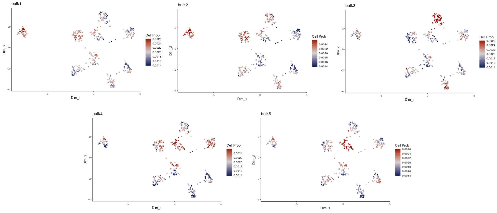
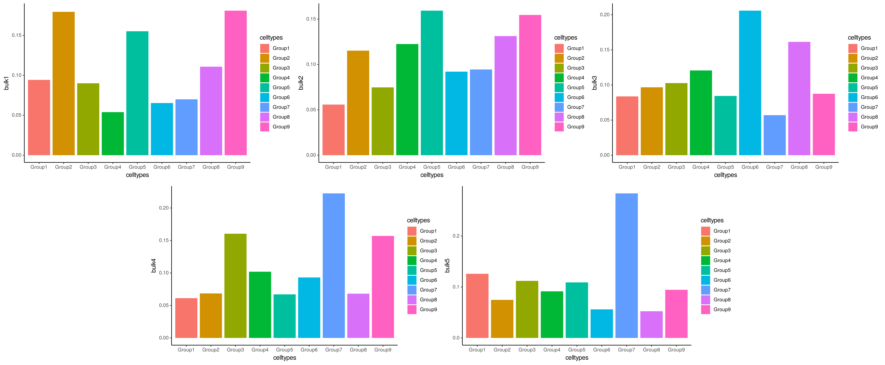

```{r, include = FALSE}
knitr::opts_chunk$set(
  collapse = TRUE,
  comment = "#>"
)
```


ConDecon is a clustering-independent method for estimating cell abundances in bulk tissues using single-cell omics data as reference. In this tutorial, we will apply ConDecon to simulated transcriptomic data and visualize the expected results.

```{r setup}
library(ConDecon)
library(ggplot2)
```


As a reference dataset, we will use simulated single-cell RNA-seq data containing 9 clusters/groups (gps). This data was generated using the software [*Splatter*](https://doi.org/10.1186/s13059-017-1305-0). We will start by loading the single-cell count and meta data provided by the ConDecon package.

```{r}
# Single-cell gene expression count data
data(counts_gps)

# Single-cell PCA latent space
data(latent_gps)

# Top 2,000 variable genes
data(variable_genes_gps)

# Meta data of single-cell RNA-seq data
data(meta_data_gps)
```

```{r}
# Visualize the cluster annotations of the single-cell RNA seq data
ggplot(data.frame(meta_data_gps), aes(x = UMAP_1, y = UMAP_2, color = celltypes)) + 
  geom_point(size = 1.5) + 
  theme_classic()
```


We will use ConDecon to deconvolve 5 simulated bulk transcriptomic profiles.

```{r}
# Bulk gene expression data, normalized by TPMs
data("bulk_gps")
```


‘RunConDecon’ is the main function necessary to infer cell abundances for each input bulk sample. This function requires 4 inputs:

1. Single-cell count matrix
2. Single-cell latent space matrix
3. Character vector of variable features associated with the single-cell data
4. Normalized bulk data matrix

The output of this function is a ConDecon object containing a Normalized_cell.probs matrix with the predicted cell probability distributions.

```{r}
ConDecon_obj = RunConDecon(counts = counts_gps, 
                           latent = latent_gps, 
                           variable.features = variable_genes_gps, 
                           bulk = bulk_gps, 
                           dims = 10)
```


With 'PlotConDecon', we can visualize the relative cell probabilities of each of the 5 bulk samples.

```{r, eval=FALSE}
PlotConDecon(ConDecon_obj = ConDecon_obj,
             umap = meta_data_gps[,c("UMAP_1", "UMAP_2")])
```
```{r, echo=FALSE, out.width="1000px"}
knitr::include_graphics("a1_Intro_bulk_CellProb.png")
```

To visualize the actual cell probabilities in each sample we can set `relative=F` in the above command:

```{r, eval=FALSE}
PlotConDecon(ConDecon_obj = ConDecon_obj,
             umap = meta_data_gps[,c("UMAP_1", "UMAP_2")], relative = F)
```
```{r, echo=FALSE, out.width="1000px"}

```

We can compare ConDecon's predictions to the true cell type proportions of each simulated bulk sample.

```{r, eval=FALSE}
data(true_prop_gps)

for(i in 1:5){
  plot(ggplot(data=true_prop_gps, aes_string(x="celltypes", y=paste0("bulk", i), 
                                             fill = "celltypes")) +
    geom_bar(stat="identity") +
    theme_classic())
}
```
```{r, echo=FALSE, out.width="1000px"}

```
