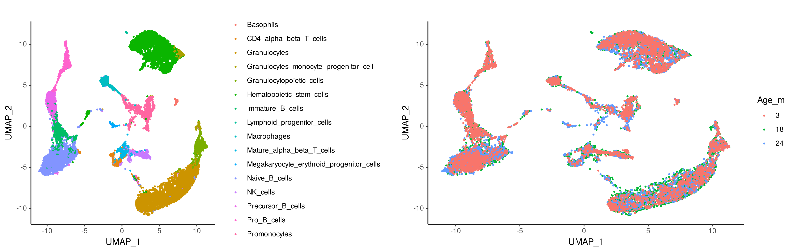
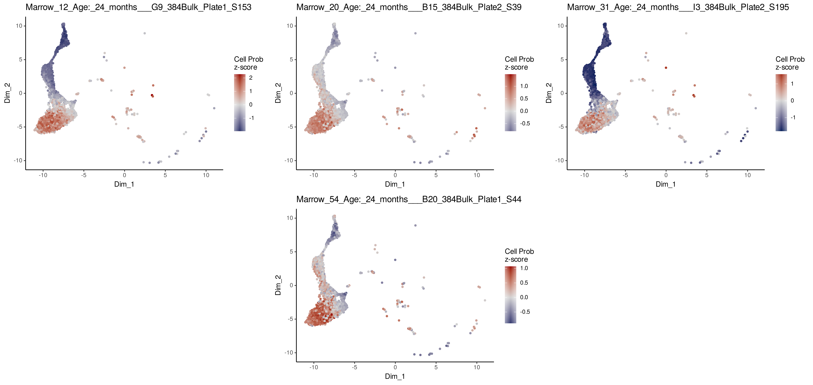
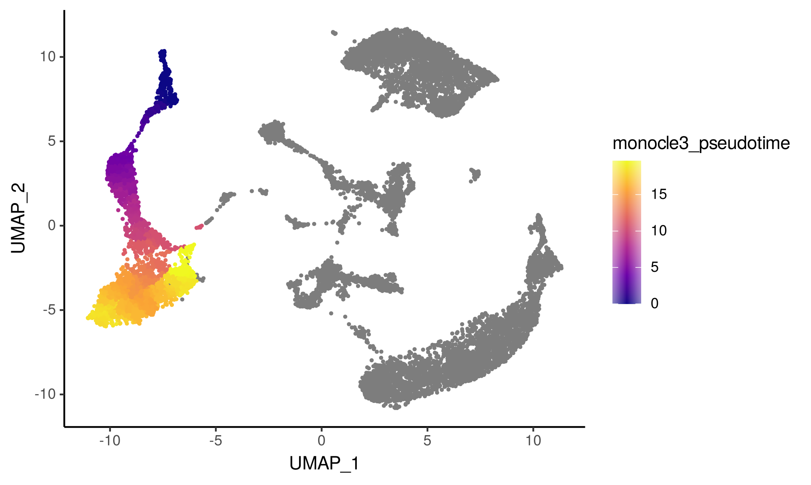
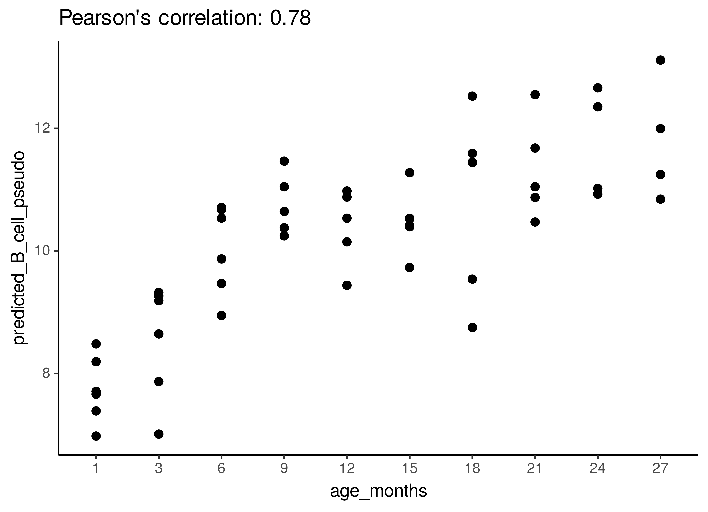

```{r, include = FALSE}
knitr::opts_chunk$set(
  collapse = TRUE,
  comment = "#>"
)
```


In this tutorial, we will use ConDecon to study changes in single-cell abundance associated with continuous cellular processes. We will consider single-cell and bulk RNA-seq data from the bone marrow of mice ages 1-27months ([Tabula Muris Consortium](https://doi.org/10.1038/s41586-020-2496-1)) and used these data to study changes in cell abundance associated with development and aging. We are particularly interested in well-characterized changes in B-cell abundance that occur during postnatal development. For convenience, the processed data associated with this tutorial is available on [Zenodo](https://zenodo.org/record/7604026#.Y-EzEC_MIuU).


```{r, eval=FALSE}
library(ConDecon)
library(ggplot2)
library(gridExtra)
```


As a reference dataset, we will use single-cell RNA-seq data from across the life span of a mouse. 

```{r, eval=FALSE}
scRNA_count <- readRDS("../scRNA_counts.Rds")
scRNA_Harmony <- readRDS("../scRNA_Harmony.Rds")
scRNA_var_genes <- readRDS("../scRNA_var_genes.Rds")
scRNA_meta_data <- readRDS("../scRNA_meta_data.Rds")
```

```{r, eval=FALSE}
# Visualize the cell types of the single-cell RNA-seq data
g1 <- ggplot(scRNA_meta_data, aes(x = UMAP_1, y = UMAP_2, color = cellType)) + 
  geom_point(size = 0.5) + 
  theme_classic()
# Visualize the mouse age of the single-cell RNA-seq data
g2 <- ggplot(scRNA_meta_data, aes(x = UMAP_1, y = UMAP_2, 
                                  color = factor(as.character(Age_months), levels = c(3,18,24)))) + 
  geom_point(size = 0.5) + 
  theme_classic()

grid.arrange(g1, g2, ncol=2)
```
```{r, echo=FALSE, out.width="1000px"}

```


We are interested in using ConDecon to deconvolve 53 bulk RNA-seq samples from 10 time points.

```{r, eval=FALSE}
BulkRNA_data <- readRDS("../BulkRNA_data.Rds")
BulkRNA_meta_data <- readRDS("../BulkRNA_meta_data.Rds")
```


We can now use 'RunConDecon' to deconvolve bulk RNA-seq data using single-cell RNA-seq data as reference.

```{r, eval=FALSE}
startTime <- Sys.time()

ConDecon_obj = RunConDecon(counts = scRNA_count, 
                           latent = scRNA_Harmony[,1:30], 
                           bulk = BulkRNA_data, 
                           variable.features = scRNA_var_genes)

endTime <- Sys.time()
print(endTime - startTime)
#Time difference of 17.17469 mins
```


With 'PlotConDecon', we can visualize the relative cell probabilities of each bulk sample. We find that ConDecon is able to recapitulate the continuous transition from an abundance of pro B-cells in young mice (≤ 3 months) to an abundance of naïve mature B-cells in fully developed mice.

```{r, eval=FALSE}
# Visualize ConDecon's inferred cell abundance for bulk samples from 1 month
PlotConDecon(ConDecon_obj = ConDecon_obj, 
             umap = scRNA_meta_data[,c("UMAP_1", "UMAP_2")], 
             samples = row.names(BulkRNA_meta_data)[BulkRNA_meta_data$Age_months == 1], 
             cells = row.names(scRNA_meta_data)[scRNA_meta_data$cellType %in% 
                                                  c("Pro_B_cells", "Immature_B_cells", "late pro-B cell", "Naive_B_cells", "Precursor_B_cells")])
```
```{r, echo=FALSE, out.width="1000px"}
knitr::include_graphics("a2_TM_B_cells_1month.png")
```

```{r, eval=FALSE}
# Visualize ConDecon's inferred cell abundance for bulk samples from 12 months
PlotConDecon(ConDecon_obj = ConDecon_obj, 
             umap = scRNA_meta_data[,c("UMAP_1", "UMAP_2")], 
             samples = row.names(BulkRNA_meta_data)[BulkRNA_meta_data$Age_months == 12], 
             cells = row.names(scRNA_meta_data)[scRNA_meta_data$cellType %in% 
                                                  c("Pro_B_cells", "Immature_B_cells", "late pro-B cell", "Naive_B_cells", "Precursor_B_cells")])
```
```{r, echo=FALSE, out.width="1000px"}
knitr::include_graphics("a2_TM_B_cells_12months.png")
```

```{r, eval=FALSE}
# Visualize ConDecon's inferred cell abundance for bulk samples from 24 months
PlotConDecon(ConDecon_obj = ConDecon_obj, 
             umap = scRNA_meta_data[,c("UMAP_1", "UMAP_2")], 
             samples = row.names(BulkRNA_meta_data)[BulkRNA_meta_data$Age_months == 24], 
             cells = row.names(scRNA_meta_data)[scRNA_meta_data$cellType %in% 
                                                  c("Pro_B_cells", "Immature_B_cells", "late pro-B cell", "Naive_B_cells", "Precursor_B_cells")])
```
```{r, echo=FALSE, out.width="1000px"}

```


We can now use the cell probabilities inferred by ConDecon to deconvolve the pseudotime in bulk RNA-seq data. Using 'TransferFeatures', we will estimate the pseudotime of B-cells within each bulk sample and compare these to the age of each mouse.

```{r, eval=FALSE}
ConDecon_obj = TransferFeatures(ConDecon_obj = ConDecon_obj, 
                                feature = scRNA_meta_data$monocle3_pseudotime)
# Transferring scRNA_meta_data$monocle3_pseudotime... 
```

Here we will visualize the inferred B-cell pseudotime in the single-cell RNA-seq data.


```{r, eval=FALSE}
# Visualize the pseudotime of the B cells in the single-cell RNA-seq data
ggplot(scRNA_meta_data, aes(x = UMAP_1, y = UMAP_2, color = monocle3_pseudotime)) + 
  geom_point(size = 0.5) + 
  scale_color_viridis_c(option = "plasma") +
  theme_classic()
```
```{r, echo=FALSE, out.width="700px"}

```

We can compare the estimated pseudotime of B-cells within each bulk sample to the age of each bulk sample. Consistent with the notion that there is a shift from an abundance of Pro B-cells in young mice to an abundance of Naive B-cells in fully developed mice, we find a strong correlation between ConDecon's estimated B-cell pseudotime and the age of the mouse in each bulk sample.


```{r, eval=FALSE}
ggplot(data.frame(age_months = BulkRNA_meta_data$Age_months, predicted_B_cell_pseudo = ConDecon_obj$TransferFeatures[1,]), 
       aes(x = age_months, y = predicted_B_cell_pseudo)) + 
  geom_point(size = 2) + 
  ggtitle(paste0("Pearson's correlation: ", round(cor(ConDecon_obj$TransferFeatures[1,], 
                                                    as.numeric(BulkRNA_meta_data$Age_months)), 2))) +
  theme_classic()
```
```{r, echo=FALSE, out.width="700px"}

```

